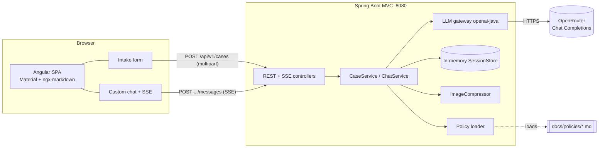
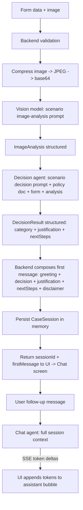
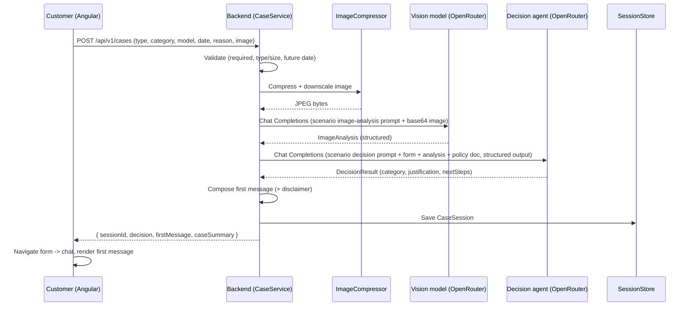
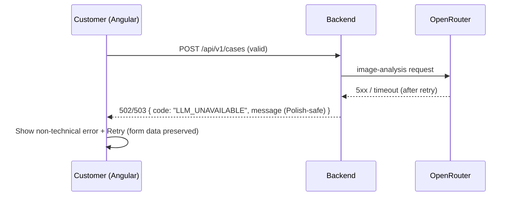

# ADR: Hardware Service Decision Copilot — Main Architecture

**Date:** 2026-06-24
**Status:** Accepted
**PRD:** [`docs/PRD-Product-Requirements-Document.md`](../PRD-Product-Requirements-Document.md)

---

## 1. Overview

This ADR set defines the technical architecture for the **Hardware Service Decision Copilot** — a self-service web app where a customer submits an electronics **return** or **complaint** with one photo, receives a preliminary, advisory eligibility decision produced by LLMs, and can then chat with the agent for follow-ups (PRD §1, §4).

This document (000) covers the overall system: stack, repository layout, module map, shared data models, cross-cutting decisions, environment, end-to-end flows, and the global testing strategy. Three area ADRs refine each layer:

- [`001-backend-api.md`](001-backend-api.md) — Spring Boot API, session store, image compression, orchestration.
- [`002-llm-integration.md`](002-llm-integration.md) — openai-java + OpenRouter, prompt strategy, structured outputs, streaming, API choice.
- [`003-frontend.md`](003-frontend.md) — Angular + Angular Material UI, form, custom chat, SSE consumption.

### Scope decisions carried from PRD clarifications
- **Primary user:** end customer (self-service); decision is **advisory**, never binding.
- **Streaming:** the **first decision message** is generated as a structured result and shown after a spinner; **follow-up chat turns stream** token-by-token over SSE.
- **State:** server-side **in-memory** session store behind an interface; no database in the MVP (persistence is Backlog — PRD §12).
- **Run setup:** two local dev processes (Angular dev server → Spring Boot) with a dev proxy.
- **LLM API:** **Chat Completions** via OpenRouter (not the Responses API — see §8 and ADR-002).

---

## 2. Context7 Library References

Implementing agents must fetch docs using these handles — do not re-search.

| Library | Context7 Handle | Used for |
|---|---|---|
| OpenAI Java SDK | `/openai/openai-java` | LLM calls to OpenRouter (chat completions, vision, streaming, structured outputs) |
| Spring Boot | `/spring-projects/spring-boot` | Backend REST API, multipart upload, SSE, validation, config |
| Angular | `/websites/angular_dev` | Frontend SPA (standalone components, signals, HttpClient) |
| Angular Material | `/websites/material_angular_dev` | UI components (form field, select, datepicker, progress, cards) |
| ngx-markdown | `/jfcere/ngx-markdown` | Render the formatted Polish decision/chat messages as markdown |

Version-pinned alternates (use if pinning): Spring Boot 3.5 → `/websites/spring_io_spring-boot_3_5`; Angular 18 → `/websites/v18_angular_dev`.

Libraries without a confirmed handle (resolve with `resolve-library-id` at implementation time if docs are needed): **Thumbnailator** (Java image compression), **WireMock** (mock OpenRouter in tests), **Playwright** (E2E).

---

## 3. System Architecture

### Architecture pattern
**SPA + REST API**, two independently built and run applications in one monorepo:
- **Frontend:** Angular single-page app (standalone components, signal-based state).
- **Backend:** Spring Boot **servlet (MVC)** application exposing a JSON/multipart REST API plus one SSE endpoint. MVC (not WebFlux) is chosen because the openai-java SDK is blocking; `SseEmitter` on a worker thread bridges the SDK's streaming iterator to the client cleanly (see §8).

No database in the MVP. The backend is the only component that holds OpenRouter credentials and talks to the LLM provider; the browser never sees the API key.

### Repository structure
```
app/
  backend/                 Spring Boot + Maven application
    src/main/java/...       controllers, services, llm client, session store, dto
    src/main/resources/     application.yaml, prompt templates, policy docs (copied/loaded)
    src/test/java/...       unit + integration tests
    pom.xml
  frontend/                Angular + Angular Material application
    src/app/                standalone components, services, models
    src/app/features/intake/   intake form screen
    src/app/features/chat/      chat screen
    proxy.conf.json         dev proxy /api -> http://localhost:8080
    package.json
docs/
  PRD-Product-Requirements-Document.md
  ADR/                     this folder
  policies/                polityka-zwrotow.md, polityka-reklamacji.md (injected into prompts)
```
The two **policy documents** in `docs/policies/` are the source of truth for the agent's rules; the backend loads their text at startup and injects it into the decision prompts (ADR-002). Implementation may copy them into `backend/src/main/resources` or read them from the repo path — decided in ADR-001.

### Technology stack

| Layer | Technology | Reason |
|---|---|---|
| Backend runtime | Java 21 (LTS) | Current LTS; supported by openai-java and Spring Boot 3.5 |
| Backend framework | Spring Boot 3.5.x (Spring Web MVC) | Mature servlet stack; first-class multipart, validation, `SseEmitter`; matches team expertise |
| Build (backend) | Maven | Explicitly requested; standard for Spring Boot |
| LLM SDK | openai-java `com.openai:openai-java` (4.41.0, verify latest patch) | Official SDK; configurable base URL → OpenRouter; supports vision, streaming, structured outputs |
| LLM provider | OpenRouter (Chat Completions API) | Provider per `.env.example`; normalized GA endpoint with stable vision + streaming + structured outputs |
| Image compression | Thumbnailator (or built-in ImageIO) | Simple downscale + JPEG re-encode before base64 (ADR-001) |
| Frontend framework | Angular (latest stable; pin Material + ngx-markdown to same major) | Explicitly requested; standalone components + signals suit streaming UI |
| UI components | Angular Material | Explicitly requested; covers form field, select, datepicker, progress, cards |
| Chat UI | Custom component built on Material primitives | No maintained, non-SaaS Material chat library exists (see ADR-003) |
| Markdown | ngx-markdown | De-facto Angular markdown renderer; sanitizes output |
| Build (frontend) | Angular CLI | Standard; provides dev server + proxy |

---

## 4. Module Structure & Dependencies

### Backend modules (packages)
- **`web` (controllers)** — REST + SSE endpoints; request/response DTOs; validation; error mapping. Depends on `application` services. Nothing depends on it.
- **`application` (orchestration services)** — `CaseService` (form→analysis→decision orchestration), `ChatService` (follow-up streaming). Depends on `llm`, `session`, `image`, `policy`. Depended on by `web`.
- **`llm` (LLM gateway)** — wraps openai-java; exposes `analyzeImage(...)`, `decide(...)`, `streamChat(...)`. Depends on SDK + config. Depended on by `application`. (ADR-002)
- **`image` (compression)** — `ImageCompressor`. Pure utility. Depended on by `application`.
- **`session` (state)** — `SessionStore` interface + in-memory implementation. Depended on by `application`. The interface is the seam for future SQLite persistence (Backlog).
- **`policy` (rules loader)** — loads the two policy documents’ text. Depended on by `application`/`llm`.
- **`config`** — client/bean wiring, environment binding. Depended on by all.

Dependency direction is strictly inward: `web → application → {llm, session, image, policy}`. No circular dependencies.

### Frontend modules
- **`core`** — API service (HTTP + SSE), models, error handling.
- **`features/intake`** — intake form component + form state.
- **`features/chat`** — custom chat component, message list, composer, markdown rendering, SSE consumption.
- **`shared`** — reusable UI bits, validators.

Direction: `features → core`; `shared` is leaf. No feature depends on another feature directly; navigation form→chat is via the router/state.

---

## 5. Data Models

Conceptual (no schema code). Persisted **in memory** only, for the lifetime of the backend process.

### CaseSession
The aggregate for one customer case.
- `sessionId` — opaque unique id (string).
- `type` — enum: `REKLAMACJA` (complaint) | `ZWROT` (return).
- `category` — enum from the fixed equipment list (PRD §8).
- `model` — string (device model/name).
- `purchaseDate` — date (must not be future).
- `reason` — string; required when `type = REKLAMACJA`.
- `imageAnalysis` — `ImageAnalysis` (below).
- `decision` — `DecisionResult` (below).
- `messages` — ordered list of `ChatMessage`.
- `createdAt` — timestamp.
Relationships: one CaseSession has one ImageAnalysis, one DecisionResult, many ChatMessages.

### ImageAnalysis (output of the vision model)
- `summary` — short Polish/neutral description of what is visible.
- `observations` — list of key visual findings.
- `scenarioFlags` — scenario-specific structured fields:
  - Return: `signsOfUse` (bool/uncertain), `visibleDamage` (bool/uncertain), `complete` (bool/uncertain), `resellableAsNew` (bool/uncertain).
  - Complaint: `visibleDamage` (bool), `damageType` (string), `likelyCause` (enum: `MANUFACTURING_DEFECT` | `USER_CAUSED` | `NORMAL_WEAR` | `INCONCLUSIVE`).
- `confidence` — low/medium/high (drives escalation).

### DecisionResult (output of the decision agent — structured)
- `category` — enum: `ELIGIBLE` | `NOT_ELIGIBLE` | `NEEDS_HUMAN_REVIEW` | `MORE_INFO_REQUIRED` (PRD AC-15).
- `justification` — Polish text referencing photo findings + applicable policy rule (AC-17).
- `nextSteps` — Polish text/list.
- `missingInfo` — list, populated only for `MORE_INFO_REQUIRED`.
Note: the **disclaimer is NOT taken from the model** — it is appended deterministically by the backend (AC-24), so it is always present and consistent.

### ChatMessage
- `role` — `assistant` | `user`.
- `content` — markdown string.
- `createdAt` — timestamp.
The agent's first message (the formatted decision) is the first `assistant` message, assembled by the backend from `DecisionResult` + fixed greeting/disclaimer templates.

---

## 6. API / Interface Contracts

Base path `/api/v1`. Full field-level detail in ADR-001.

| Endpoint | Method | Input | Output | Notes |
|---|---|---|---|---|
| `/cases` | POST (multipart/form-data) | form fields + one image | `{ sessionId, decision, firstMessage, caseSummary }` (JSON) | Validates, compresses image, runs vision + decision; creates session |
| `/cases/{sessionId}/messages` | POST | `{ message }` (JSON) | `text/event-stream` of token deltas + terminal event | Follow-up chat; **streamed** (SSE) |
| `/cases/{sessionId}` | GET | — | case summary + transcript (JSON) | Optional convenience (page reload within session) |
| `/health` | GET | — | status | Liveness (Spring Boot Actuator acceptable) |

Error model (shared): JSON `{ code, message, fields? }` with appropriate HTTP status. Concrete codes/statuses in ADR-001 (validation 400, unsupported type 415, too large 413, unknown session 404, upstream LLM failure 502/503).

---

## 7. Environment Variables

| Variable | Purpose | Required | Example value |
|---|---|---|---|
| `OPENROUTER_API_KEY` | OpenRouter credential (used unless `OPENAI_API_KEY` is set) | Yes | `sk-or-v1-...` |
| `OPENROUTER_BASE_URL` | LLM API base URL | Yes | `https://openrouter.ai/api/v1` |
| `OPENROUTER_TEXT_MODEL` | Model for decision + chat reasoning | Yes | `openai/gpt-5.4-mini` |
| `OPENROUTER_VISION_MODEL` | Model for multimodal image analysis | Yes | `openai/gpt-5.4-mini` |
| `OPENROUTER_MODEL` | Fallback model if a split var is missing | No | `openai/gpt-5.4-mini` |
| `OPENAI_API_KEY` | Optional override credential; if set, used instead of `OPENROUTER_API_KEY` | No | `sk-...` |
| `OPENROUTER_APP_URL` | Optional `HTTP-Referer` header for OpenRouter attribution | No | `http://localhost:4200` |
| `OPENROUTER_APP_TITLE` | Optional `X-Title` header for OpenRouter attribution | No | `Hardware Service Decision Copilot` |
| `SERVER_PORT` | Backend port | No | `8080` |

The backend reads these via Spring configuration. The frontend never receives credentials; it calls the backend only.

---

## 8. Technical Decisions

### Chat Completions API over the Responses API
**Status:** Accepted **Date:** 2026-06-24
**Context:** OpenRouter exposes both a Chat Completions and a Responses endpoint; we must pick one for vision and for multi-turn chat.
**Decision:** Use **Chat Completions** through OpenRouter for both image analysis and chat. OpenRouter's Responses endpoint is documented as **beta, stateless, and feature-thin** (streaming/structured-outputs/vision not documented there), while Chat Completions is the normalized GA path with stable vision (base64 `image_url`), SSE streaming, and `response_format` structured outputs. The openai-java SDK speaks both with equal effort, so there is no SDK cost to this choice.
**Rejected alternatives:**
- *Responses API:* beta on OpenRouter, stateless anyway (no server-side history benefit), vision/streaming undocumented there.
- *Provider-native (OpenAI direct):* contradicts the `.env.example` OpenRouter setup and reduces model flexibility.
**Consequences:** (+) Most reliable, model-agnostic feature set. (+) Same SDK, same code path for both calls. (−) We manage conversation history ourselves (acceptable; we hold it in the session store anyway).
**Review trigger:** If OpenRouter promotes Responses to GA with vision+streaming, or if we need server-side conversation state from the provider.

### Spring Web MVC + SseEmitter (not WebFlux)
**Status:** Accepted **Date:** 2026-06-24
**Context:** The chat must stream tokens, but the openai-java SDK returns a blocking `StreamResponse`, not a reactive `Flux`.
**Decision:** Use the **servlet stack (Spring MVC)** and return an `SseEmitter` from the chat endpoint; a worker thread iterates the SDK's streaming chunks and pushes SSE events. This avoids manually bridging a blocking iterator into a reactive pipeline.
**Rejected alternatives:**
- *Spring WebFlux:* would require wrapping the blocking SDK stream onto a bounded-elastic scheduler / `Sinks.Many` — more complexity for no MVP benefit.
**Consequences:** (+) Simple, well-understood concurrency model; one worker thread per active stream. (−) Thread-per-stream does not scale to thousands of concurrent chats (irrelevant at MVP scale).
**Review trigger:** If concurrent active chat streams are expected to exceed a few hundred.

### Server-side in-memory session store behind an interface
**Status:** Accepted **Date:** 2026-06-24
**Context:** Conversation context (form, image analysis, decision, transcript) must persist across turns; the MVP has no database, but persistence is a planned Backlog item.
**Decision:** Define a `SessionStore` interface with an in-memory (concurrent map) implementation. Sessions are keyed by `sessionId`. The interface is the seam to later add a SQLite-backed implementation without touching orchestration code.
**Rejected alternatives:**
- *Stateless (client resends full history):* larger payloads, client owns transcript, and re-uploading image-analysis context each turn is awkward.
- *Immediate SQLite:* out of MVP scope; adds schema/migration work now.
**Consequences:** (+) Small payloads, clean seam for persistence. (−) State lost on backend restart and not shared across instances (acceptable for single-instance MVP).
**Review trigger:** When the Backlog persistence/audit item is started, or when running more than one backend instance.

### Backend appends the mandatory disclaimer deterministically
**Status:** Accepted **Date:** 2026-06-24
**Context:** Every decision message must include the legal disclaimer (PRD AC-24), and the decision category must be one of four fixed values (AC-15).
**Decision:** The decision agent returns a **structured** `DecisionResult` (category enum + justification + next steps) via the LLM's structured-output mode; the backend composes the customer-facing first message from fixed Polish greeting/disclaimer templates plus the model's justification/next-steps. The disclaimer text is never delegated to the model.
**Rejected alternatives:**
- *Let the model produce the whole message including disclaimer:* risks missing/altered disclaimer and free-form categories.
**Consequences:** (+) Guarantees AC-15 and AC-24 deterministically; easier to test. (−) Slightly less "natural" phrasing; mitigated by passing justification/next-steps through verbatim.
**Review trigger:** If product wants fully model-authored messages.

### Two local dev processes with a dev proxy
**Status:** Accepted **Date:** 2026-06-24
**Context:** Need the fastest inner loop for a course MVP.
**Decision:** Run Angular dev server on `:4200` with `proxy.conf.json` forwarding `/api` to Spring Boot on `:8080`. No CORS in dev; no production packaging in scope.
**Rejected alternatives:** *Docker Compose* (more setup); *single artifact / Spring serves Angular* (slower frontend rebuild loop).
**Consequences:** (+) Fast, simple. (−) Production deployment undefined (out of MVP scope; revisit later).
**Review trigger:** When a deployable/production build is required.

---

## 9. Diagrams

### 9.1 Architecture / Component Diagram


### 9.2 Data Flow Diagram


### 9.3 Sequence Diagrams

#### Form submission → analysis → decision (happy path)


#### Follow-up chat (streaming)
```mermaid
sequenceDiagram
    participant U as Customer (Angular)
    participant B as Backend (ChatService)
    participant S as SessionStore
    participant C as Chat model (OpenRouter)
    U->>B: POST /api/v1/cases/{id}/messages { message } (fetch + ReadableStream)
    B->>S: Load session (404 if unknown)
    B->>B: Append user message; build full context (form + analysis + decision + transcript)
    B->>C: Chat Completions stream=true
    loop token deltas
      C-->>B: chunk
      B-->>U: SSE data: token
    end
    C-->>B: end
    B->>S: Append assistant message
    B-->>U: SSE event: done
```

#### Error path — upstream LLM unavailable


---

## 10. Testing Strategy

### Philosophy
TDD per `AGENTS.md`: write/extend tests from the spec before production code; tests are the agent's primary self-validation. The external LLM is the only thing mocked in integration tests; unit tests mock all dependencies; E2E runs the real stack with a stubbed/recorded LLM.

### Test layers

| Layer | Type | Scope | Tools |
|---|---|---|---|
| Unit (BE) | Fast, all deps mocked | Validation, image compression, session store, prompt assembly, message composition, error mapping | JUnit 5, Mockito, AssertJ |
| Integration (BE) | Only external LLM mocked | Controller → service → LLM gateway with HTTP; multipart upload; SSE emission | Spring Boot Test, MockMvc, **WireMock** (stub OpenRouter) |
| Unit (FE) | All deps mocked | Form validation logic, SSE parsing, signal state updates, markdown rendering wiring | Angular testing utilities (CLI default) |
| E2E | Nothing mocked except LLM (stubbed/recorded) | Full form→decision→chat journey in a browser | Playwright (per qa-engineer) |

### Key test scenarios
- **Happy path return — eligible:** valid form (Zwrot) + clean photo → vision says no signs of use → decision `ELIGIBLE`; first message contains decision + disclaimer. Edge: purchase date exactly 14 days ago.
- **Happy path complaint — defect:** valid form (Reklamacja, reason present) + damaged photo → decision reflects manufacturing-defect path. Edge: ambiguous cause → `NEEDS_HUMAN_REVIEW`.
- **Validation failures:** missing required field; missing reason when Reklamacja; wrong file type (415); >10 MB (413); future purchase date (400). Each returns the specific error code and blocks submission.
- **Insufficient evidence:** unclear photo / missing model → `MORE_INFO_REQUIRED` with `missingInfo` populated.
- **Upstream failure:** OpenRouter 5xx/timeout → 502/503, non-technical message, no session leaked; client can retry with data preserved.
- **Chat streaming:** follow-up returns incremental SSE tokens; assistant message accumulates; transcript saved.
- **Unknown session:** chat to a non-existent `sessionId` → 404.
- **Off-topic chat:** agent declines and redirects (assert behavior via stubbed LLM contract).

### Technical acceptance criteria (complement PRD ACs)
- **TAC-01:** `POST /api/v1/cases` rejects files with content type other than `image/jpeg|png|webp` with HTTP 415 and a specific code.
- **TAC-02:** `POST /api/v1/cases` rejects images >10 MB with HTTP 413 before any LLM call.
- **TAC-03:** A future `purchaseDate` yields HTTP 400 with a field-level error and no LLM call.
- **TAC-04:** The decision is parsed into exactly one of the four enum categories; any other value from the model is treated as an error and mapped to `NEEDS_HUMAN_REVIEW`.
- **TAC-05:** The composed first message always contains the mandatory disclaimer text, independent of model output.
- **TAC-06:** The image is compressed/downscaled before the vision call (verified: outgoing payload smaller than input; long edge ≤ configured max).
- **TAC-07:** The chat endpoint returns `Content-Type: text/event-stream` and emits ≥1 token event then a terminal `done` event for a successful turn.
- **TAC-08:** When the LLM gateway throws after retries, the API returns 502/503 and no partial session is persisted in an inconsistent state.
- **TAC-09:** No OpenRouter credential is ever present in any frontend bundle or API response.
- **TAC-10:** Backend never calls OpenRouter's `/responses` endpoint (only `/chat/completions`).
