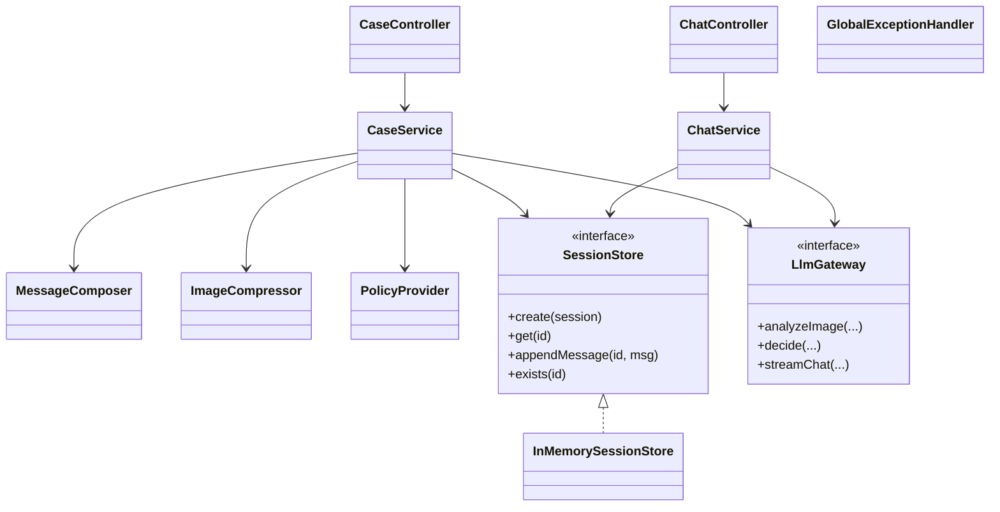
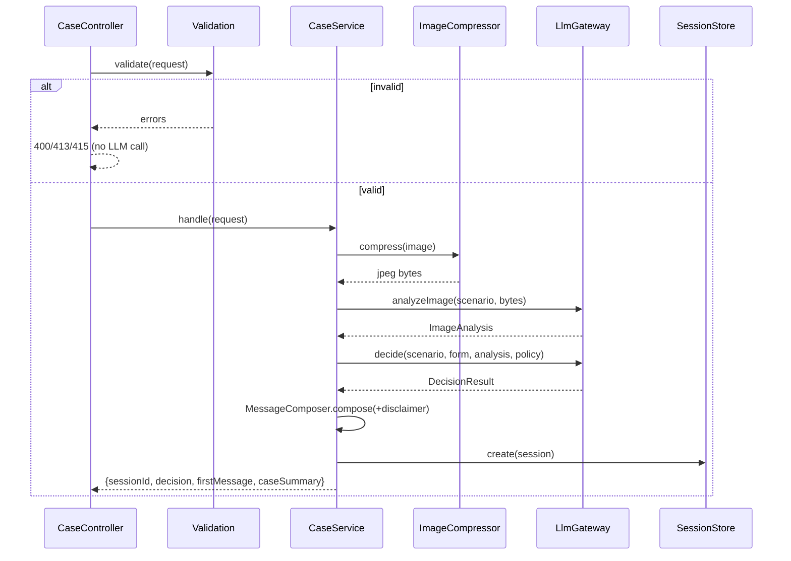
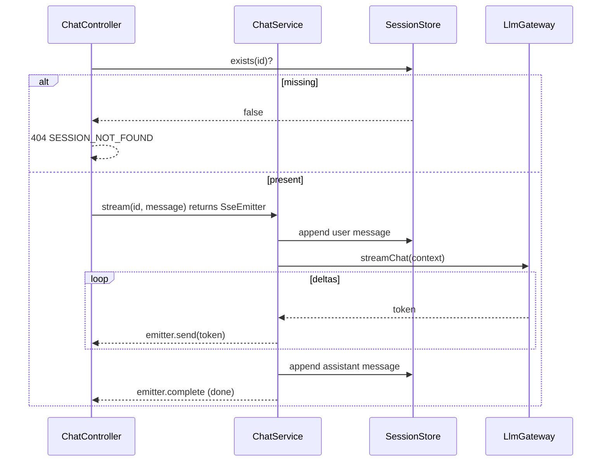

# ADR-001: Backend API (Spring Boot)

**Date:** 2026-06-24
**Status:** Accepted
**Relates to:** [`000-main-architecture.md`](000-main-architecture.md)

---

## 1. Scope

Covers the Spring Boot backend: REST + SSE endpoints, request validation, image compression, orchestration of the LLM calls, the in-memory session store, error handling, and configuration. It does **not** cover the LLM client internals, prompt content, or structured-output schemas (see [`002-llm-integration.md`](002-llm-integration.md)) nor any frontend concern (see [`003-frontend.md`](003-frontend.md)).

---

## 2. Context7 References

| Library | Context7 Handle | Used for |
|---|---|---|
| Spring Boot | `/spring-projects/spring-boot` | Web MVC controllers, multipart, validation, SSE, config, Actuator |
| openai-java | `/openai/openai-java` | Consumed via the LLM gateway (ADR-002) |
| Thumbnailator | resolve at impl time | Image downscale + JPEG re-encode (alt: built-in `javax.imageio`) |
| WireMock | resolve at impl time | Stub OpenRouter in integration tests |

---

## 3. Component Design

Layered servlet application. Dependency direction is inward only.

- **Controllers (`web`)**
  - `CaseController` — `POST /api/v1/cases` (multipart), `GET /api/v1/cases/{id}`.
  - `ChatController` — `POST /api/v1/cases/{id}/messages` returning `SseEmitter`.
  - `GlobalExceptionHandler` (`@RestControllerAdvice`) — maps exceptions to the shared error model.
- **Services (`application`)**
  - `CaseService` — orchestrates: validate → compress → `LlmGateway.analyzeImage` → `LlmGateway.decide` → compose first message → save session.
  - `ChatService` — loads session, builds context, calls `LlmGateway.streamChat`, pushes SSE events, appends assistant message on completion.
  - `MessageComposer` — builds the customer-facing first message (fixed Polish greeting + decision body + fixed disclaimer). Deterministic; no LLM.
- **Image (`image`)**
  - `ImageCompressor` — validate format, downscale to a configured max long edge (e.g. 1024 px), re-encode JPEG at a configured quality, return bytes. Pure, unit-testable.
- **Session (`session`)**
  - `SessionStore` interface: `create`, `get`, `appendMessage`, `exists`. In-memory implementation backed by a concurrent map. Seam for future SQLite (Backlog).
- **Policy (`policy`)**
  - `PolicyProvider` — loads the two policy documents’ text once and exposes them by scenario (`ZWROT` → return policy, `REKLAMACJA` → complaint policy).
- **Config (`config`)**
  - Binds environment variables (000 §7) into typed config; defines the OpenRouter client bean (ADR-002); configures multipart limits.

State management: the only mutable state is the `SessionStore`. SSE streaming uses one worker thread per active emitter; the thread iterates the LLM stream and completes/errors the emitter.

---

## 4. Data Structures

Request/response DTOs (conceptual; validation annotations applied in code).

### Submit case — request (multipart/form-data)
| Field | Type | Constraints |
|---|---|---|
| `type` | enum | `REKLAMACJA` \| `ZWROT`; required |
| `category` | enum | one of the fixed equipment categories (PRD §8); required |
| `model` | string | required, non-blank, max length (e.g. 120) |
| `purchaseDate` | date (ISO `yyyy-MM-dd`) | required; not in the future |
| `reason` | string | required & non-blank when `type=REKLAMACJA`; optional when `ZWROT`; max length (e.g. 2000) |
| `image` | file | required; content type `image/jpeg|png|webp`; ≤ 10 MB |

### Submit case — response (JSON)
| Field | Type | Notes |
|---|---|---|
| `sessionId` | string | opaque id |
| `decision.category` | enum | `ELIGIBLE` \| `NOT_ELIGIBLE` \| `NEEDS_HUMAN_REVIEW` \| `MORE_INFO_REQUIRED` |
| `decision.justification` | string | Polish |
| `decision.nextSteps` | string | Polish |
| `decision.missingInfo` | string[] | present only for `MORE_INFO_REQUIRED` |
| `firstMessage` | string (markdown) | fully composed assistant message incl. disclaimer |
| `caseSummary` | object | echo of `type, category, model, purchaseDate` for the chat header |

### Chat message — request (JSON)
| Field | Type | Constraints |
|---|---|---|
| `message` | string | required, non-blank, max length (e.g. 2000) |

### Chat message — response (SSE, `text/event-stream`)
- Repeated events carrying token deltas (event data = text fragment).
- Terminal event signaling completion (`done`).
- On failure mid-stream: an `error` event then emitter completes with error.

### Error model (JSON)
| Field | Type | Notes |
|---|---|---|
| `code` | string | machine code (see §5) |
| `message` | string | safe message (UI may show a Polish equivalent) |
| `fields` | object | optional per-field validation messages |

---

## 5. Interface Contracts

### `POST /api/v1/cases`
- **Consumes:** `multipart/form-data`. **Produces:** `application/json`.
- **Success:** `200 OK` with submit-case response.
- **Errors:**
  - `400 VALIDATION_ERROR` — missing/blank required field, missing reason for complaint, future purchase date, malformed date. Includes `fields`.
  - `415 UNSUPPORTED_MEDIA_TYPE` — image content type not JPEG/PNG/WebP.
  - `413 PAYLOAD_TOO_LARGE` — image > 10 MB (enforced by multipart limits and an explicit check before any LLM call).
  - `502 LLM_UNAVAILABLE` / `503 LLM_UNAVAILABLE` — vision or decision call failed after retries; no session persisted.
- **Notes:** no auth (MVP). Order of operations guarantees no LLM call happens if validation fails.

### `POST /api/v1/cases/{sessionId}/messages`
- **Consumes:** `application/json`. **Produces:** `text/event-stream`.
- **Success:** `200 OK` with SSE stream (token events + `done`).
- **Errors:** `404 SESSION_NOT_FOUND` (unknown id), `400 VALIDATION_ERROR` (empty message), `502/503 LLM_UNAVAILABLE` (emitted as an SSE `error` event if failure occurs after the stream opened; otherwise as an HTTP error before streaming).
- **Notes:** consumed by the frontend via `fetch()` + `ReadableStream` (POST + headers), not `EventSource`.

### `GET /api/v1/cases/{sessionId}`
- **Produces:** `application/json` — `caseSummary` + transcript. `404` if unknown. Convenience for in-session reload; not required by core flow.

### `GET /health`
- Liveness; Spring Boot Actuator `health` endpoint is acceptable.

---

## 6. Technical Decisions

### Validate and enforce limits before any LLM call
**Status:** Accepted **Date:** 2026-06-24
**Context:** LLM calls cost money/latency; invalid input must never reach them.
**Decision:** Bean Validation on the request plus an explicit pre-check (file type, size, future date) executes fully before compression or any OpenRouter call.
**Rejected alternatives:** *Validate lazily inside the service* — risks paid calls on bad input.
**Consequences:** (+) No wasted LLM spend on invalid input; deterministic error codes. (−) A little duplication between multipart limits and explicit checks (intentional, for precise error codes).
**Review trigger:** If validation rules move to a shared schema/contract layer.

### Compress to JPEG, max long edge ~1024 px, before vision call
**Status:** Accepted **Date:** 2026-06-24
**Context:** Vision input is base64-inlined; large images inflate payload ~33% and may exceed model limits (ADR-002).
**Decision:** Downscale to a configurable max long edge (default ~1024 px) and re-encode JPEG at a configurable quality; use Thumbnailator (fallback: `javax.imageio`).
**Rejected alternatives:** *Send original image* — larger payload, possible model rejection; *aggressive downscale* — may lose damage detail needed for the assessment.
**Consequences:** (+) Smaller, predictable payloads; (−) some detail loss — quality/size are tunable config, validated by tests (TAC-06).
**Review trigger:** If image assessment accuracy suffers, or a model supports/needs higher resolution.

### SSE via `SseEmitter` with one worker thread per stream
**Status:** Accepted **Date:** 2026-06-24
**Context:** Per 000 §8, the SDK stream is blocking; chat must stream.
**Decision:** `ChatController` returns an `SseEmitter`; a bounded task executor runs the blocking LLM stream iteration and pushes events, completing or erroring the emitter. Configure a sensible SSE timeout.
**Rejected alternatives:** *WebFlux/Flux bridging* (000 §8).
**Consequences:** (+) Simple; (−) thread-per-stream limits extreme concurrency (irrelevant at MVP scale); needs a bounded executor to avoid thread exhaustion.
**Review trigger:** High concurrent stream count.

### Policy documents loaded at startup, selected by scenario
**Status:** Accepted **Date:** 2026-06-24
**Context:** The agent's rules come from `docs/policies/*.md` (PRD §8).
**Decision:** `PolicyProvider` loads both documents’ text once (from classpath resources copied at build, or a configured path) and returns the correct one per `type`. The decision prompt injects the full text (ADR-002).
**Rejected alternatives:** *Hardcode rules in prompts* — duplicates the source-of-truth documents; *reload per request* — needless I/O.
**Consequences:** (+) Single source of truth, fast access. (−) Editing a policy requires a restart (acceptable; revisit if hot-reload needed).
**Review trigger:** When policies must change without redeploy, or when RAG (Backlog) replaces static injection.

---

## 7. Diagrams

### Component / Class Diagram

### Sequence — submit case (with validation gate)

### Sequence — chat stream

---

## 8. Testing Strategy

### Test scenarios for this area

| Scenario | Type | Input | Expected output | Edge cases |
|---|---|---|---|---|
| Valid complaint submit | Integration (LLM stubbed) | Reklamacja + reason + valid JPEG | 200; decision parsed; first message has disclaimer | reason at max length |
| Missing reason for complaint | Unit + Integration | Reklamacja, blank reason | 400 VALIDATION_ERROR, field `reason`; no LLM call | whitespace-only reason |
| Wrong file type | Integration | `.gif`/`.pdf` upload | 415 UNSUPPORTED_MEDIA_TYPE; no LLM call | spoofed extension vs content type |
| Oversized image | Integration | 11 MB file | 413 PAYLOAD_TOO_LARGE; no LLM call | exactly 10 MB allowed |
| Future purchase date | Unit + Integration | date = tomorrow | 400 VALIDATION_ERROR, field `purchaseDate` | today allowed |
| Image compression | Unit | large JPEG/PNG/WebP | output JPEG, long edge ≤ max, smaller bytes | tiny image not upscaled |
| Decision enum mapping | Unit | model returns unexpected category | mapped to NEEDS_HUMAN_REVIEW | empty/garbled structured output |
| Message composition | Unit | DecisionResult | first message contains greeting + body + disclaimer | each of 4 categories |
| Upstream LLM failure | Integration (WireMock 5xx) | valid submit | 502/503 LLM_UNAVAILABLE; no session created | timeout; retry then fail |
| Chat happy path | Integration (WireMock SSE) | valid message to existing session | text/event-stream; ≥1 token + done; assistant msg saved | multi-chunk stream |
| Chat unknown session | Integration | bad sessionId | 404 SESSION_NOT_FOUND | well-formed but absent id |
| Session store | Unit | create/get/append/exists | correct lifecycle behavior | concurrent appends |

### Technical acceptance criteria
- **TAC-001-01:** Validation failures (400/413/415) occur with zero outbound LLM calls (verified via WireMock request count = 0).
- **TAC-001-02:** `ImageCompressor` output is JPEG with long edge ≤ configured max and byte size ≤ input for a representative large image.
- **TAC-001-03:** Any decision category outside the four-enum set returned by the model is coerced to `NEEDS_HUMAN_REVIEW` (TAC-04 in 000).
- **TAC-001-04:** `MessageComposer` output for every category contains the exact mandatory disclaimer substring.
- **TAC-001-05:** The chat endpoint produces `Content-Type: text/event-stream`, emits ≥1 data event and a terminal `done` for a stubbed successful stream.
- **TAC-001-06:** Upstream 5xx after configured retries yields 502/503 and leaves `SessionStore` with no new entry for that request.
- **TAC-001-07:** `POST /cases/{id}/messages` to an unknown id returns 404 `SESSION_NOT_FOUND` before any LLM call.
- **TAC-001-08:** Multipart max size is configured so a >10 MB upload is rejected at the framework boundary as 413.
