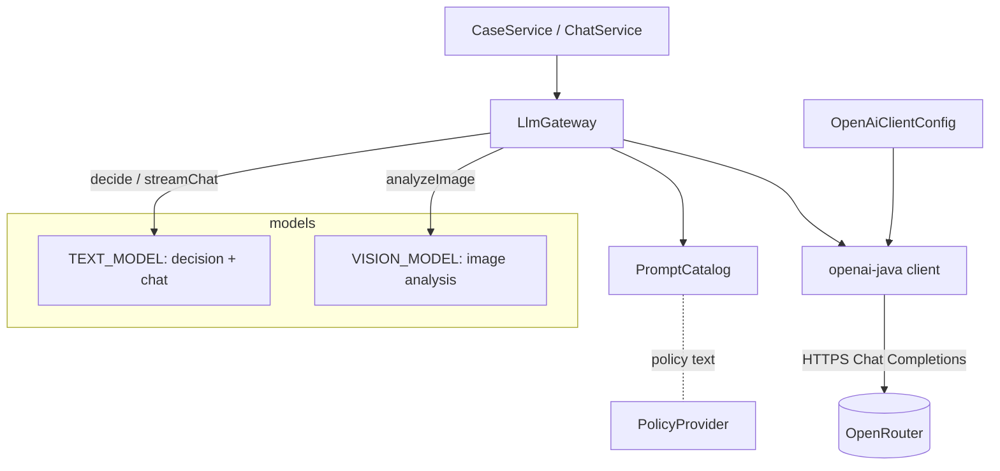
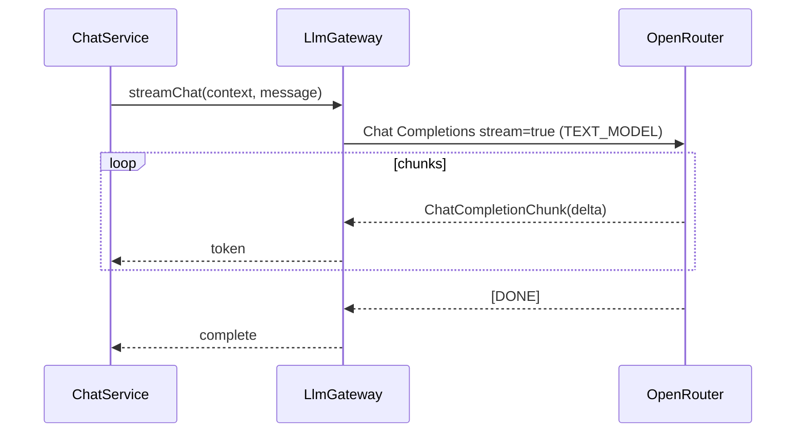

# ADR-002: LLM Integration (openai-java + OpenRouter)

**Date:** 2026-06-24
**Status:** Accepted
**Relates to:** [`000-main-architecture.md`](000-main-architecture.md), [`001-backend-api.md`](001-backend-api.md)

---

## 1. Scope

Covers everything about talking to the LLM: the openai-java SDK, pointing it at OpenRouter, the choice of Chat Completions over the Responses API, model selection, the three LLM operations (image analysis, decision, chat), prompt strategy (two scenarios × operations), structured outputs for the decision and image analysis, streaming, retries, and the gateway interface. It does **not** cover HTTP endpoints (ADR-001) or UI (ADR-003).

---

## 2. Context7 References

| Library | Context7 Handle | Used for |
|---|---|---|
| openai-java | `/openai/openai-java` | Client config, chat completions, vision, streaming, structured outputs |
| OpenRouter | (web docs) `https://openrouter.ai/docs` | Endpoint behavior, model catalog, image/structured-output support |

**Verified facts (2026):**
- Maven: `com.openai:openai-java:4.41.0` (verify latest patch on Maven Central at impl time).
- Base URL configurable via the client builder (`.baseUrl(...)`) and API key via `.apiKey(...)`.
- Chat Completions, streaming (`StreamResponse<ChatCompletionChunk>`), vision (base64 `image_url`), and structured outputs (`.responseFormat(Class)`) are all supported by the SDK and by OpenRouter's Chat Completions endpoint.
- OpenRouter's Responses endpoint is **beta + stateless**, with vision/streaming/structured-output **not documented** there.

---

## 3. Component Design

A single gateway abstracts the SDK from the rest of the app.

- **`LlmGateway` (interface)** — the only seam the application layer sees:
  - `analyzeImage(scenario, imageBytesOrDataUrl) → ImageAnalysis`
  - `decide(scenario, formData, imageAnalysis, policyText) → DecisionResult`
  - `streamChat(sessionContext, userMessage) → token stream`
- **`OpenRouterLlmGateway` (implementation)** — builds requests, calls the SDK, parses structured results, exposes the streaming iterator.
- **`OpenAiClientConfig`** — defines the SDK client bean configured for OpenRouter:
  - `.apiKey(OPENAI_API_KEY ?? OPENROUTER_API_KEY)` (OpenAI key wins if present, per `.env.example`).
  - `.baseUrl(OPENROUTER_BASE_URL)` (default `https://openrouter.ai/api/v1`).
  - Optional attribution headers `HTTP-Referer` (`OPENROUTER_APP_URL`) and `X-Title` (`OPENROUTER_APP_TITLE`) via per-request additional headers.
  - **Do not use `fromEnv()`** — it would silently pick up `OPENAI_BASE_URL`/`OPENAI_API_KEY` and could hit api.openai.com. Configure explicitly.
- **`PromptCatalog`** — holds the four prompt templates (return/complaint × image-analysis/decision) plus the chat system prompt; fills in form data, image analysis, and injected policy text.
- **Model selection:** image analysis uses `OPENROUTER_VISION_MODEL`; decision and chat use `OPENROUTER_TEXT_MODEL`; `OPENROUTER_MODEL` is the fallback if a split var is missing.

---

## 4. Data Structures

### ImageAnalysis (structured output of the vision call)
Returned via structured/JSON output (one schema, scenario-relevant fields populated):
- `summary` (string), `observations` (string[]), `confidence` (`LOW|MEDIUM|HIGH`).
- Return scenario: `signsOfUse`, `visibleDamage`, `complete`, `resellableAsNew` — each `YES|NO|UNCERTAIN`.
- Complaint scenario: `visibleDamage` (`YES|NO|UNCERTAIN`), `damageType` (string), `likelyCause` (`MANUFACTURING_DEFECT|USER_CAUSED|NORMAL_WEAR|INCONCLUSIVE`).

### DecisionResult (structured output of the decision call)
- `category` (`ELIGIBLE|NOT_ELIGIBLE|NEEDS_HUMAN_REVIEW|MORE_INFO_REQUIRED`).
- `justification` (string, Polish) — must reference photo findings and the applicable policy rule.
- `nextSteps` (string, Polish).
- `missingInfo` (string[]) — only for `MORE_INFO_REQUIRED`.

### Chat context (input to streamChat)
- A system prompt (role, constraints, mandatory-disclaimer reminder, off-topic handling).
- A compact rendering of: form data, `ImageAnalysis`, the `DecisionResult`, and prior transcript messages.

---

## 5. Interface Contracts (LLM operations)

### analyzeImage(scenario, image)
- **Input:** scenario (`ZWROT|REKLAMACJA`), compressed image as base64 data URL (`data:image/jpeg;base64,...`).
- **Model:** `OPENROUTER_VISION_MODEL`. **Output:** `ImageAnalysis` (structured).
- **Prompt:** scenario-specific image-analysis prompt (PRD AC-11/12/13). The prompt instructs the model to describe only what is visible and to use `UNCERTAIN`/`INCONCLUSIVE` rather than guessing.
- **Errors:** SDK/transport errors after retries → thrown as a gateway exception (mapped to 502/503 upstream).

### decide(scenario, form, analysis, policyText)
- **Input:** scenario, form data, `ImageAnalysis`, and the **full text of the matching policy document**.
- **Model:** `OPENROUTER_TEXT_MODEL` with **structured output** forcing `DecisionResult`. **Output:** `DecisionResult`.
- **Prompt:** scenario-specific decision prompt (PRD AC-14). Rules: decide only from inputs + policy; never invent rules/prices/dates (AC-19); when evidence is insufficient/contradictory return `MORE_INFO_REQUIRED`/`NEEDS_HUMAN_REVIEW`, never a forced verdict (AC-18).
- **Errors:** invalid/garbled structured output → coerce category to `NEEDS_HUMAN_REVIEW` (000 TAC-04); transport errors → gateway exception.

### streamChat(context, message)
- **Input:** full session context + user message.
- **Model:** `OPENROUTER_TEXT_MODEL`, `stream=true`. **Output:** ordered token deltas (`StreamResponse<ChatCompletionChunk>`), consumed by `ChatService` and pushed as SSE.
- **Behavior:** stays on-topic; declines and redirects off-topic requests (AC-23); the backend still owns the disclaimer for the first message, but the chat system prompt reminds the agent of the advisory, non-binding framing.

---

## 6. Technical Decisions

### Use the official openai-java SDK pointed at OpenRouter
**Status:** Accepted **Date:** 2026-06-24
**Context:** Backend is Java/Spring; we need vision, streaming, and structured outputs against OpenRouter.
**Decision:** Use `com.openai:openai-java` configured with an explicit `.baseUrl(OPENROUTER_BASE_URL)` and `.apiKey(...)`. The SDK's Chat Completions, vision, streaming, and structured-output features all work through OpenRouter.
**Rejected alternatives:**
- *Spring AI:* heavier abstraction; the task explicitly references openai-java and OpenRouter; direct SDK keeps the surface small and the docs precise.
- *Raw HTTP/WebClient:* re-implements serialization, streaming parsing, and structured outputs by hand.
- *LangChain4j:* extra abstraction not needed for three well-defined calls.
**Consequences:** (+) First-class, documented features; minimal glue. (−) SDK is blocking (handled by SSE worker thread, 001 §6); ties us to the OpenAI-shaped request model (fine via OpenRouter's compatibility).
**Review trigger:** If we adopt Spring AI for RAG (Backlog) or need multi-provider abstraction.

### Chat Completions API, not the Responses API
**Status:** Accepted **Date:** 2026-06-24
**Context:** Both endpoints exist on OpenRouter; the SDK supports both.
**Decision:** Use **Chat Completions** for image analysis, decision, and chat. (Full rationale in 000 §8.) OpenRouter's Responses endpoint is beta, stateless, and does not document vision/streaming/structured outputs; Chat Completions is GA and feature-complete for our needs.
**Rejected alternatives:** *Responses API* — beta/feature-thin on OpenRouter; no state benefit (we hold history in the session store).
**Consequences:** (+) Reliable vision/streaming/structured outputs across models. (−) We manage history ourselves (already required). **Verifiable:** the backend never calls `/responses` (000 TAC-10).
**Review trigger:** OpenRouter promotes Responses to GA with vision + streaming + structured outputs.

### Structured outputs for both image analysis and decision
**Status:** Accepted **Date:** 2026-06-24
**Context:** The decision must be one of four fixed categories (AC-15) and machine-consumable; image analysis must feed the decision deterministically.
**Decision:** Use the SDK's structured-output mode (`.responseFormat(Class)` → strict JSON schema) for `DecisionResult` and `ImageAnalysis`. Keep client-side schema validation enabled as a safety net; coerce any invalid decision category to `NEEDS_HUMAN_REVIEW`.
**Rejected alternatives:** *Free-text + regex/parsing* — brittle; *function/tool calling* — heavier than needed for a single structured return.
**Consequences:** (+) Deterministic parsing, testable enums. (−) Strict JSON-schema adherence depends on the chosen model supporting it; mitigated by validation + coercion and by choosing a structured-output-capable model.
**Review trigger:** If the configured model does not honor strict json_schema.

### Vision via base64 data URL on the compressed JPEG
**Status:** Accepted **Date:** 2026-06-24
**Context:** Image must reach the vision model; backend already compresses (001).
**Decision:** Inline the compressed JPEG as a base64 `data:image/jpeg;base64,...` `image_url` content part. No external image hosting.
**Rejected alternatives:** *Public URL hosting* — needs storage + public access, more moving parts and privacy exposure.
**Consequences:** (+) No storage dependency; private. (−) ~33% base64 inflation and model-side per-image limits — addressed by compression (001) and by verifying the model's image limits.
**Review trigger:** If images regularly exceed the model's inline size limit.

### Retry with backoff on transient upstream errors; fail closed
**Status:** Accepted **Date:** 2026-06-24
**Context:** OpenRouter/model calls can transiently fail or time out.
**Decision:** Apply a small bounded retry with backoff on transient errors (timeouts, 429, 5xx) for `analyzeImage`/`decide`; on exhaustion, throw a gateway exception mapped to 502/503 with no partial session. Streaming chat surfaces post-open failures as an SSE `error` event.
**Rejected alternatives:** *No retry* — brittle; *unbounded retry* — unbounded latency/cost.
**Consequences:** (+) Resilience to blips; (−) added latency on retries; configurable.
**Review trigger:** If error rates or latency budgets change.

---

## 7. Diagrams

### Component diagram


### Sequence — decision generation (structured)
```mermaid
sequenceDiagram
    participant S as CaseService
    participant G as LlmGateway
    participant P as PromptCatalog
    participant O as OpenRouter
    S->>G: analyzeImage(scenario, base64 jpeg)
    G->>P: image-analysis prompt (scenario)
    G->>O: Chat Completions (VISION_MODEL, image_url, response_format=ImageAnalysis)
    O-->>G: ImageAnalysis (structured)
    G-->>S: ImageAnalysis
    S->>G: decide(scenario, form, analysis, policyText)
    G->>P: decision prompt (scenario) + inject policy text
    G->>O: Chat Completions (TEXT_MODEL, response_format=DecisionResult)
    O-->>G: DecisionResult (structured)
    G->>G: validate enum; coerce invalid -> NEEDS_HUMAN_REVIEW
    G-->>S: DecisionResult
```

### Sequence — chat streaming


---

## 8. Prompt Strategy (content guidance, not source)

Four prompt templates + one chat system prompt, all producing/operating in Polish for customer-facing text:

1. **Return image-analysis** — assess signs of use/wear, damage, completeness, resellable-as-new; output `ImageAnalysis`; prefer `UNCERTAIN` over guessing.
2. **Complaint image-analysis** — identify visible damage, damage type, and likely cause (`MANUFACTURING_DEFECT|USER_CAUSED|NORMAL_WEAR|INCONCLUSIVE`); output `ImageAnalysis`.
3. **Return decision** — inputs: form + `ImageAnalysis` + return policy text. Apply policy rules (14-day window from purchase date, condition/resellable-as-new). Output `DecisionResult`. Escalate when uncertain.
4. **Complaint decision** — inputs: form + `ImageAnalysis` + complaint policy text. Apply policy (rękojmia window, defect vs user-caused). Output `DecisionResult`. Escalate when cause is ambiguous.
5. **Chat system prompt** — role, advisory/non-binding framing, on-topic only (decline+redirect off-topic), uses full session context, plain Polish, honest tone.

Hard rules embedded in all prompts: never invent rules/prices/dates/specs (AC-19); decide only from provided inputs + policy; when evidence insufficient/contradictory choose `MORE_INFO_REQUIRED`/`NEEDS_HUMAN_REVIEW` (AC-18).

---

## 9. Testing Strategy

### Test scenarios for this area

| Scenario | Type | Input | Expected output | Edge cases |
|---|---|---|---|---|
| Client points at OpenRouter | Unit | config with base URL | requests target `OPENROUTER_BASE_URL`, never api.openai.com | `OPENAI_API_KEY` set → used as key |
| Vision structured parse | Integration (WireMock) | stubbed vision JSON | `ImageAnalysis` populated per scenario | missing optional fields |
| Decision enum mapping | Unit/Integration | stubbed decision JSON for each category | correct `DecisionResult` | unknown category → NEEDS_HUMAN_REVIEW |
| Insufficient evidence | Integration | stub returns low confidence | MORE_INFO_REQUIRED with missingInfo, or NEEDS_HUMAN_REVIEW | empty observations |
| Policy injection | Unit | decide() called | request body contains the matching policy text | wrong scenario → wrong doc (must not happen) |
| Model routing | Unit | analyzeImage vs decide | uses VISION_MODEL vs TEXT_MODEL respectively | split var missing → fallback OPENROUTER_MODEL |
| Streaming chat | Integration (WireMock SSE) | stubbed token stream | ordered tokens then complete | mid-stream error → error surfaced |
| Retry/fail-closed | Integration | WireMock 5xx ×N | retried then gateway exception | 429 retried; permanent 4xx not retried |
| No /responses usage | Integration | any LLM op | only `/chat/completions` hit | assert path |

### Technical acceptance criteria
- **TAC-002-01:** All LLM HTTP requests target the configured `OPENROUTER_BASE_URL`; none target `api.openai.com`.
- **TAC-002-02:** When `OPENAI_API_KEY` is set it is used as the credential; otherwise `OPENROUTER_API_KEY` is used.
- **TAC-002-03:** `analyzeImage` uses `OPENROUTER_VISION_MODEL`; `decide` and `streamChat` use `OPENROUTER_TEXT_MODEL`; missing split var falls back to `OPENROUTER_MODEL`.
- **TAC-002-04:** `decide()` request payload contains the full text of the scenario-matching policy document.
- **TAC-002-05:** A decision category outside the four-value enum is coerced to `NEEDS_HUMAN_REVIEW`.
- **TAC-002-06:** The image is sent as a `data:image/jpeg;base64,...` `image_url` content part.
- **TAC-002-07:** Transient 5xx/timeout are retried up to the configured bound; exhaustion raises a gateway exception (no silent success).
- **TAC-002-08:** Only `/chat/completions` is called; `/responses` is never called (000 TAC-10).
