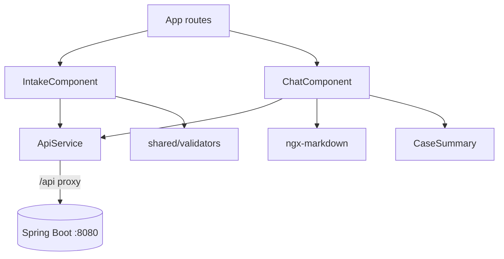
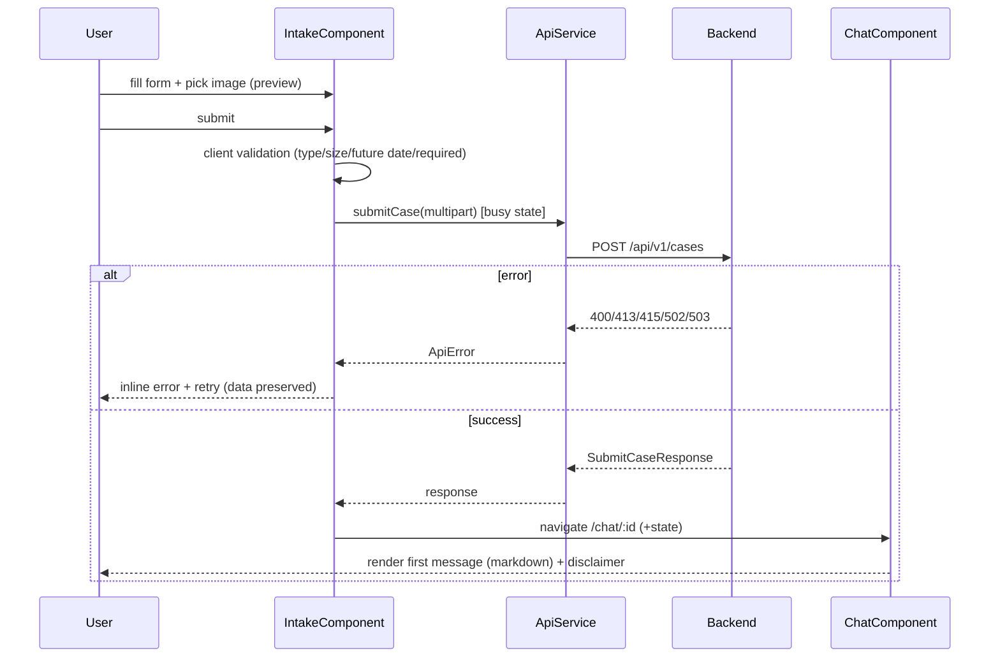

# ADR-003: Frontend (Angular + Angular Material)

**Date:** 2026-06-24
**Status:** Accepted
**Relates to:** [`000-main-architecture.md`](000-main-architecture.md), [`001-backend-api.md`](001-backend-api.md)

---

## 1. Scope

Covers the Angular single-page app: framework setup, the two screens (intake form, chat), the file-upload approach, form validation, the custom chat component, markdown rendering, SSE stream consumption, signal-based state, the dev proxy, and frontend testing. It does **not** cover backend endpoints (ADR-001) or LLM behavior (ADR-002).

---

## 2. Context7 References

| Library | Context7 Handle | Used for |
|---|---|---|
| Angular | `/websites/angular_dev` | Standalone components, signals, Reactive Forms, HttpClient |
| Angular Material | `/websites/material_angular_dev` | Form field, select, datepicker, textarea, progress, cards, buttons |
| ngx-markdown | `/jfcere/ngx-markdown` | Render formatted Polish decision + chat messages |

Pin Material and ngx-markdown to the **same major** as the chosen Angular version (they release in lockstep). Use the latest stable Angular at scaffold time (≥18, standalone is default).

---

## 3. Component Design

Standalone components, signal-based state, OnPush-friendly. Routing: two routes (`/` intake, `/chat/:sessionId` chat); navigation is one-way form→chat after a successful decision.

- **`core/api.service`** — wraps backend calls:
  - `submitCase(formData) → Observable/Promise<SubmitCaseResponse>` (multipart POST; supports upload progress).
  - `streamChat(sessionId, message) → AsyncIterable/Observable<string>` of token deltas, implemented with `fetch()` + `ReadableStream` (POST + headers).
  - Error normalization to a typed `ApiError { code, message, fields? }`.
- **`core/models`** — TypeScript types mirroring the backend DTOs (case type enum, category enum, decision category enum, message).
- **`features/intake/intake.component`** — Reactive Form, file picker + preview, validation, submit/loading/error states; on success, navigates to chat with the response in router state/store.
- **`features/chat/chat.component`** — custom chat: message list (signal), composer, typing indicator, markdown rendering, SSE consumption appending tokens to the in-progress assistant message.
- **`features/chat/case-summary`** — read-only header (type, category, model, purchase date) + photo thumbnail.
- **`shared/validators`** — `futureDateForbidden`, `requiredIfComplaint`, file type/size validators (mirror backend rules client-side; backend remains authoritative).

State: a small signal-based session store (or router state) carries the `SubmitCaseResponse` from intake to chat so the first message renders immediately without a refetch (a `GET /cases/{id}` fallback exists for reload).

---

## 4. Data Structures (frontend)

- **`CaseType`** = `'REKLAMACJA' | 'ZWROT'`.
- **`EquipmentCategory`** — union/enum of the fixed list (PRD §8), with Polish labels for display.
- **`DecisionCategory`** = `'ELIGIBLE' | 'NOT_ELIGIBLE' | 'NEEDS_HUMAN_REVIEW' | 'MORE_INFO_REQUIRED'` (drives the visual highlight of the decision bubble).
- **`SubmitCaseResponse`** — `{ sessionId, decision: { category, justification, nextSteps, missingInfo? }, firstMessage, caseSummary }`.
- **`ChatMessage`** — `{ role: 'assistant' | 'user', content: string, streaming?: boolean }`.
- **`ApiError`** — `{ code, message, fields? }`.

---

## 5. Interface Contracts (consumed)

- `POST /api/v1/cases` (multipart) → `SubmitCaseResponse`; surfaces `400/413/415/502/503` as `ApiError`. Upload uses progress events for the busy state.
- `POST /api/v1/cases/{sessionId}/messages` (JSON) → `text/event-stream`. Consumed via `fetch()` + `ReadableStream`: read chunks, decode with `TextDecoder`, split SSE frames on blank lines, strip `data:` prefixes, emit token strings; handle the terminal `done` and any `error` event.
- `GET /api/v1/cases/{sessionId}` → case summary + transcript (used on reload within a session).

All requests go to `/api/...`; the dev proxy forwards to the backend (no CORS in dev).

---

## 6. Technical Decisions

### Build a custom chat component on Material primitives (no chat library)
**Status:** Accepted **Date:** 2026-06-24
**Context:** We need a chat UI that consumes our own Spring Boot SSE stream and renders markdown.
**Decision:** Implement a lightweight custom chat from Material primitives (`mat-card`/`mat-list` bubbles, `mat-progress-spinner` typing indicator, `mat-form-field` + autosize `textarea` composer) + `ngx-markdown`. Reason: every ready-made option is unfit — Stream/CometChat are SaaS-coupled to their own realtime backends, Nebular brings a competing design system and uncertain maintenance, and Syncfusion/Ignite UI are heavy commercial licenses for a two-element screen. The community Material file-input wrappers are stale.
**Rejected alternatives:** *stream-chat-angular / CometChat* (require their backend); *Nebular chat-ui* (non-Material, maintenance risk); *Syncfusion/Ignite UI* (commercial, heavyweight).
**Consequences:** (+) Minimal, maintained dependency surface (Material + ngx-markdown) — important for an NBP/possibly air-gapped context. (+) Full control over streaming. (−) We own the chat UI code (small, well-bounded).
**Review trigger:** If chat requirements grow (threads, attachments, reactions) beyond a simple transcript.

### Native file input + Material button (no third-party file component)
**Status:** Accepted **Date:** 2026-06-24
**Context:** Angular Material has no official file-upload component; community wrappers are largely stale on Angular 18+.
**Decision:** Hidden `<input type="file" accept="image/jpeg,image/png,image/webp">` triggered by a `mat-stroked-button`; preview via `URL.createObjectURL` (revoked on destroy) in a `mat-card`; upload progress via `HttpClient` progress events on a `mat-progress-bar`. Client validates type/size; backend is authoritative.
**Rejected alternatives:** *ngx-material-file-input / @angular-material-components/file-input* (unmaintained for 18+); *@ngxmc/file-input* (niche, unverified).
**Consequences:** (+) Zero unmaintained deps, ~30 lines. (−) Slightly more manual wiring. Note: the default `fetch` HttpClient backend does not emit upload progress — enable XHR/DI interceptors if true progress is required, else show an indeterminate busy state.
**Review trigger:** If multi-file or richer upload UX is needed.

### Consume SSE with fetch() + ReadableStream (not EventSource)
**Status:** Accepted **Date:** 2026-06-24
**Context:** The chat stream is a POST (carries the message body and may need headers); `EventSource` is GET-only and cannot set custom headers.
**Decision:** Use `fetch()` + `response.body.getReader()` + `TextDecoder` to parse SSE frames, pushing each token into a `signal`. The in-progress assistant `ChatMessage` accumulates tokens; the template re-renders incrementally.
**Rejected alternatives:** *Native `EventSource`* (GET-only, no headers); *ngx-sse-client* (extra dep; verify 18+ compat).
**Consequences:** (+) POST + headers + manual control; dependency-free. (−) Manual SSE frame parsing (small, testable).
**Review trigger:** If the endpoint becomes a header-less GET, or auth requires it.

### ngx-markdown for message rendering
**Status:** Accepted **Date:** 2026-06-24
**Context:** The first message and agent replies are formatted markdown.
**Decision:** Use `ngx-markdown` (`provideMarkdown()`, standalone) to render assistant content; it sanitizes output by default. Pin its major to the Angular major.
**Rejected alternatives:** *Hand-rolled marked + DomSanitizer* (more code); *raw HTML* (unsafe).
**Consequences:** (+) Safe, standard rendering. (−) One dependency (well-maintained).
**Review trigger:** If markdown needs exceed ngx-markdown features (e.g. custom directives).

### Dev proxy to Spring Boot; signals for state
**Status:** Accepted **Date:** 2026-06-24
**Context:** Two local processes; streaming UI needs reactive updates.
**Decision:** `proxy.conf.json` maps `/api` → `http://localhost:8080`; state is signal-based (`signal`/`computed`/`effect`), with auto-scroll on new tokens via an `effect`.
**Rejected alternatives:** *CORS config in dev* (more setup); *NgRx/global store* (overkill for MVP).
**Consequences:** (+) Same-origin dev, simple reactive state. (−) Verify the CLI dev server does not buffer SSE (esbuild/Vite vs Webpack behavior varies) — fall back to hitting the backend directly if buffering appears.
**Review trigger:** Production packaging, or state complexity growth.

---

## 7. Diagrams

### Component diagram


### Sequence — intake to chat


### Sequence — streaming follow-up
```mermaid
sequenceDiagram
    participant U as User
    participant CH as ChatComponent
    participant API as ApiService
    participant BE as Backend
    U->>CH: type message + send
    CH->>CH: append user msg; add empty assistant msg (streaming)
    CH->>API: streamChat(id, message) [fetch + ReadableStream]
    API->>BE: POST /messages (Accept: text/event-stream)
    loop tokens
      BE-->>API: SSE data: token
      API-->>CH: token
      CH->>CH: messages.update(append token); auto-scroll
    end
    BE-->>API: done
    API-->>CH: complete (streaming=false)
```

---

## 8. Testing Strategy

### Test scenarios for this area

| Scenario | Type | Input | Expected output | Edge cases |
|---|---|---|---|---|
| Conditional required reason | Unit | switch type Reklamacja/Zwrot | reason required only for Reklamacja | toggle back clears error |
| Future date validator | Unit | pick tomorrow | control invalid; submit blocked | today valid |
| File type/size validators | Unit | gif / 11 MB | inline error; submit blocked | exactly 10 MB ok; webp ok |
| Image preview | Unit | select image | preview shown; object URL revoked on destroy | replace image updates preview |
| Submit success → navigate | Unit (API mocked) | valid form | navigates to chat; first message rendered | missingInfo shown for MORE_INFO_REQUIRED |
| Submit error states | Unit (API mocked) | 415/413/502 | inline non-technical error; data preserved | retry resubmits |
| SSE parsing | Unit | chunked SSE frames | tokens emitted in order; done ends stream | split frame across chunks; error event |
| Streaming render | Unit | token sequence | assistant bubble accumulates; typing indicator while streaming | empty stream |
| Markdown render | Unit | markdown first message | rendered HTML; disclaimer visible | unsafe HTML sanitized |
| Decision highlight | Unit | each DecisionCategory | correct visual treatment of decision bubble | unknown category guard |
| Full journey | E2E (Playwright) | real stack, LLM stubbed | form→decision→chat→follow-up works | validation + retry paths |

### Technical acceptance criteria
- **TAC-003-01:** Reason is required if and only if type = `REKLAMACJA`; the form cannot submit otherwise.
- **TAC-003-02:** Future purchase dates are not selectable/accepted (datepicker `max=today` + validator).
- **TAC-003-03:** Files outside JPEG/PNG/WebP or >10 MB are rejected client-side with an inline message and block submission.
- **TAC-003-04:** A selected image shows a preview; its object URL is revoked on component destroy / replacement (no leak).
- **TAC-003-05:** On submit error, entered form data is preserved and a non-technical, retryable message is shown.
- **TAC-003-06:** The SSE parser emits tokens in order, including when an SSE frame spans multiple network chunks, and ends on the `done` event.
- **TAC-003-07:** The streaming assistant bubble updates incrementally and shows a typing indicator only while streaming.
- **TAC-003-08:** The first message renders as sanitized markdown and always displays the disclaimer text.
- **TAC-003-09:** All UI labels, helper text, errors, and messages are in Polish (PRD AC-09/25).
- **TAC-003-10:** No backend credentials/secrets are referenced anywhere in the frontend; only `/api` calls are made.
