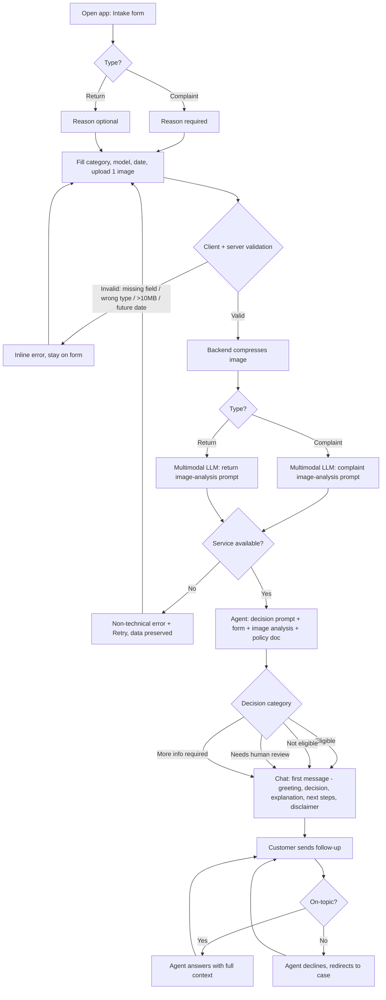

# PRD — Hardware Service Decision Copilot

> Status: MVP / PoC. Built live during the JSystems "AI dla programistów" course (NBP edition).
> This document describes **functionality, system behavior, UX and UI only**. Technology choices, data models, prompt source code, and test strategy belong in the ADR.

---

## 1. Executive Summary

Hardware Service Decision Copilot is a self-service web application that helps a **customer** find out, in minutes, whether their electronics **return** (14-day right of withdrawal) or **complaint** (rękojmia / gwarancja) is likely to be accepted. The customer fills a short form and uploads one photo of the device; the system analyzes the photo with a multimodal LLM, then a reasoning agent combines the photo analysis, the form data, and the company's published return/complaint policies to produce a **preliminary, advisory decision** with a clear justification. The decision is delivered as the first message in a chat, where the customer can ask follow-up questions.

This is an MVP. The decision is **not binding** — it is an automated preliminary assessment, and uncertain or borderline cases are routed to human review.

---

## 2. Problem Statement

When a customer wants to return a device or file a complaint about a faulty one, they cannot easily tell beforehand whether their case qualifies. The rules (14-day withdrawal window, condition requirements, statutory warranty scope, exclusions for user-caused damage) are spread across legal documents and store policies that are hard to read and apply to a specific situation. As a result:

- Customers submit returns/complaints that are obviously ineligible, then wait days for a rejection.
- Customers who actually qualify hesitate or give up because they are unsure.
- Support staff spend time on triage questions and repetitive eligibility explanations.

Today the customer's only options are to read dense policy pages, call/email support and wait, or simply ship the item and hope. There is no instant, case-specific, explained first answer.

---

## 3. Users / Personas

### Persona A — "Anna", the returning customer (primary)
Bought a device online, changed her mind, and wants to return it within the withdrawal window. She is not technical and not a lawyer. She wants a quick, plain-language answer: *"Can I return this, and what do I do next?"* She expects honesty about whether the item's condition (signs of use) disqualifies the return.

### Persona B — "Marek", the complaint customer (primary)
His device developed a fault. He wants to file a complaint (reklamacja) and is worried it will be rejected as "his fault". He wants to understand whether the visible damage looks like a manufacturing defect or like accidental/user damage, and what evidence or next step is needed.

### Persona C — "Service triage reviewer" (secondary, indirect)
A human support/service employee who receives the cases that the copilot flags as **Needs human review**. They are not a direct user of the MVP UI, but the product must produce output (decision category + justification + structured case data) that makes their later manual review faster. Building the full reviewer console is **out of scope** for the MVP.

---

## 4. Main Flows

### 4.1 Happy path — Return, eligible
1. Customer opens the app and lands on the intake **form**.
2. Customer selects **Return**, picks an equipment category, enters model name, picks the purchase date, optionally writes a reason, and uploads one photo.
3. Customer submits. The system validates inputs client-side and server-side.
4. Backend compresses the image and sends it to the multimodal LLM using the **return image-analysis prompt** (goal: detect signs of use/damage, completeness, whether the unit looks resellable as new).
5. Backend passes the image analysis + form data + the **return policy** document to the reasoning agent using the **return decision prompt**.
6. Agent returns a decision category, a justification, and next steps.
7. The app switches to the **chat** screen and renders the agent's first message: greeting, decision (**Eligible**), explanation referencing the photo and the policy, next steps, and the mandatory disclaimer.
8. Customer asks a follow-up ("Do I pay return shipping?"); the agent answers using full context.

### 4.2 Happy path — Complaint, defect detected
1–3. As above, but customer selects **Complaint**; the reason textarea is **required**.
4. Backend sends the photo with the **complaint image-analysis prompt** (goal: identify visible damage, its type, and the most likely cause — manufacturing defect vs. accidental/user-caused vs. wear).
5. Backend passes the analysis + form + **complaint policy** to the agent using the **complaint decision prompt**.
6–8. Agent returns the decision and justification; chat opens with the first message; customer can continue the conversation.

### 4.3 Alternative — Not eligible
- Return where the photo shows clear signs of use, or the purchase date is outside the 14-day window → decision **Not eligible**, with the specific disqualifying reason and the disclaimer that the customer may still escalate to a human.

### 4.4 Alternative — Needs human review
- Borderline or conflicting evidence (e.g. photo inconclusive, damage cause ambiguous, policy edge case) → decision **Needs human review**. The agent explains why it cannot decide and what a human will check.

### 4.5 Alternative — More info required
- The provided data/photo is insufficient (e.g. photo does not show the relevant part, missing model, vague reason) → decision **More info required**, listing exactly what is missing. The customer can supply it in chat.

### 4.6 Error paths
- **Validation error**: missing required field, wrong file type, oversized file, or future purchase date → inline error, no submission.
- **Image analysis / agent service unavailable**: the system shows a non-technical error message and lets the customer retry without re-entering the form.
- **Off-topic chat**: the agent declines and steers back to the return/complaint case.

---

## 5. User Stories

1. **(Happy — return)** As a returning customer, I want to submit my device details and a photo and get an instant eligibility answer, so that I know whether to ship it back before wasting time.
2. **(Happy — complaint)** As a complaint customer, I want the system to assess my photo and tell me if the damage looks like a covered defect, so that I understand my chances and next steps.
3. **(Chat follow-up)** As a customer, I want to ask follow-up questions after the decision, so that I can clarify shipping, timelines, or what evidence to add, without starting over.
4. **(Invalid input)** As a customer, I want clear inline messages when my file is the wrong type/too large or a required field is empty, so that I can fix it immediately.
5. **(Service down)** As a customer, I want a friendly error and a retry option when the AI service is unavailable, so that I don't lose the data I already entered.
6. **(Ambiguous case)** As a customer, I want the system to tell me honestly when it can't decide and that a human will review, so that I'm not given a false verdict.
7. **(Insufficient evidence)** As a customer, I want to be told exactly what extra information or photo is needed, so that I can complete my case in the chat.
8. **(Trust / disclaimer)** As a customer, I want every decision to clearly state it is preliminary and not binding, so that I understand a human makes the final call.

---

## 6. Acceptance Criteria

### Form
- **AC-01** The form presents a **Type** selector with exactly two options: *Reklamacja (Complaint)* and *Zwrot (Return)*.
- **AC-02** The form presents an **equipment category** selector populated from a fixed predefined list (see §8 Functional).
- **AC-03** The form provides a free-text **model/name** input (required).
- **AC-04** The form provides a **date of purchase** picker that rejects future dates.
- **AC-05** The form provides a **reason** textarea that is **required when Type = Complaint** and optional when Type = Return.
- **AC-06** The form requires **exactly one image** upload; submission is blocked without it.
- **AC-07** The image upload accepts only JPEG, PNG, and WebP and rejects files larger than **10 MB** before compression, returning a specific error message for each violation.
- **AC-08** All required-field, file-type, file-size, and future-date violations are shown inline and prevent submission.
- **AC-09** All form labels, options, helper text, and error messages are in **Polish**.

### Image Analysis
- **AC-10** On submit, the backend compresses/downscales the image before sending it to the multimodal LLM.
- **AC-11** The system uses a **different image-analysis prompt** for Complaint vs. Return.
- **AC-12** For Return, the image analysis reports presence/absence of signs of use, damage, completeness, and resellable-as-new assessment.
- **AC-13** For Complaint, the image analysis reports visible damage, damage type, and most likely cause (manufacturing defect / accidental or user-caused / normal wear).

### AI Decision
- **AC-14** The agent uses a **different decision prompt** for Complaint vs. Return.
- **AC-15** The agent's decision is exactly one of four categories: **Eligible**, **Not eligible**, **Needs human review**, **More info required**.
- **AC-16** The decision is produced from the combination of: form data, image analysis output, and the corresponding policy document (complaint policy or return policy).
- **AC-17** Every decision includes a justification that references the concrete reasons (condition/photo findings and the applicable policy rule).
- **AC-18** When evidence is insufficient or contradictory, the agent must return **Needs human review** or **More info required** and must not assert a definitive Eligible/Not eligible verdict.
- **AC-19** The agent never invents policy rules, prices, dates, or facts not present in the inputs or policy documents.

### Chat
- **AC-20** After a successful decision, the UI transitions from form to chat and renders the agent's **first message** containing: greeting, decision category, explanation, next steps, and the disclaimer — formatted for readability.
- **AC-21** The agent has access to the full context (form data, image analysis, first decision message) for all subsequent turns.
- **AC-22** The customer can send follow-up messages and receives context-aware answers.
- **AC-23** Off-topic requests are declined and redirected to the return/complaint topic.
- **AC-24** Every decision message includes the mandatory disclaimer that the assessment is preliminary, automated, and not binding (see §11).

### General
- **AC-25** All customer-facing text (form, chat, decisions, errors, disclaimers) is in **Polish**.
- **AC-26** If the image-analysis or agent service fails, the customer sees a non-technical error and can retry without re-entering form data.
- **AC-27** The decision output is structured enough (category + justification + case data) to hand a **Needs human review** case to a human later.

---

## 7. Out of Scope

The following are explicitly **NOT** part of the MVP. Several are planned for later (see §12 Backlog) and the architecture should not preclude them.

- **Authentication / user accounts** — no login, no identity verification.
- **Customer & purchase-history lookup** — no retrieval of existing customer records or order history from any database in the MVP. *(Planned — Backlog.)*
- **Session/decision persistence to a database** — no durable storage of sessions, decisions, or audit trail in the MVP. *(Planned — Backlog.)*
- **Agent RAG knowledge base** — no retrieval over an internal electronics/specs/procedures knowledge base beyond the two policy documents injected into the prompt. *(Planned — Backlog.)*
- **Human reviewer console / admin UI** — no back-office screen for triage reviewers.
- **Multiple image upload / video** — exactly one image; no video, no document attachments.
- **Notifications** — no email/SMS/push to the customer or staff.
- **Payments, shipping label generation, RMA issuance** — the app advises; it does not execute the return/complaint transaction.
- **Multilingual UI** — Polish only.
- **Native mobile apps** — responsive web only.
- **Editing/withdrawing a submitted case** — once submitted, the case proceeds to chat; no case management.
- **Final/binding decisions** — the system is advisory only.

---

## 8. Constraints

### Business
- The decision is **advisory and non-binding**; the company retains the right to make the final determination through human review.
- The product must align with **Polish consumer law**: the 14-day right of withdrawal for distance sales (return) and statutory warranty (rękojmia) / manufacturer guarantee (gwarancja) for complaints.
- Every decision must carry a disclaimer stating it is a preliminary automated assessment (see §11).
- The agent must not provide individualized binding legal advice; it explains policy as published.

### Functional
- **Image**: exactly one file; formats JPEG, PNG, WebP; max **10 MB** pre-compression; backend compresses/downscales before LLM submission.
- **Equipment categories (predefined list)**: Smartfony i telefony; Laptopy i komputery; Tablety; Telewizory i monitory; Audio (słuchawki, głośniki); Konsole i gaming; Smartwatche i wearables; Aparaty i fotografia; Małe AGD; Akcesoria (ładowarki, kable, etui); Inne.
- **Type options (predefined list)**: Reklamacja (Complaint); Zwrot (Return).
- **Purchase date**: cannot be in the future.
- **Reason**: required for Complaint, optional for Return.
- **Language**: all user-facing text in Polish.
- **Platform**: responsive web (desktop + mobile browsers); single-session, no persistence in MVP.

### External document / data references

These starter policy documents are created with the MVP and injected into the agent's prompt as the rules to follow. They are examples to be reviewed/replaced by the business.

| Document | File path | When it is used |
|---|---|---|
| Polityka zwrotów (Return policy) | `docs/policies/polityka-zwrotow.md` | Injected into the agent's **return decision prompt** when Type = Zwrot |
| Polityka reklamacji (Complaint policy) | `docs/policies/polityka-reklamacji.md` | Injected into the agent's **complaint decision prompt** when Type = Reklamacja |

---

## 9. UI Description (wireframe level)

### 9.1 Screen 1 — Intake form
**Layout (top to bottom):**
- Short title and one-line explanation of what the tool does.
- **Type** selector (Reklamacja / Zwrot) — the first and primary choice; changing it adjusts whether Reason is required.
- **Equipment category** selector (dropdown from the predefined list).
- **Model / name** text input.
- **Date of purchase** date picker (future dates disabled).
- **Reason** textarea (marked required when Complaint is selected; optional label when Return).
- **Image upload** control: single-file picker / drag-and-drop, with a thumbnail preview once selected and a way to replace it. Helper text states accepted formats and the 10 MB limit.
- **Submit** button.

**States:**
- *Empty*: submit disabled or, on click, surfaces inline validation.
- *Validation error*: per-field inline messages (required, wrong type, too large, future date).
- *Submitting / loading*: submit shows a busy state; the form is locked while the image is analyzed and the decision is generated; a progress indication communicates that the photo is being analyzed.
- *Error*: a non-technical error banner with a **Retry** action that preserves entered data.

### 9.2 Screen 2 — Chat
**Layout:**
- A scrollable conversation area. The **first message** is the agent's decision bubble: greeting → decision category (visually distinct/highlighted) → explanation → next steps → disclaimer footer.
- A compact, read-only summary of the submitted case (type, category, model, purchase date) and the uploaded photo thumbnail, visible for context.
- A message input with a send button at the bottom.

**States:**
- *Initial*: only the agent's decision message is present.
- *Agent typing/loading*: a pending indicator while the agent responds.
- *Conversation*: alternating customer and agent bubbles; full history retained for the session.
- *Off-topic*: the agent's bubble politely declines and redirects.
- *Error*: if a follow-up fails, an inline error with retry; the prior conversation is preserved.

### 9.3 Navigation
- Single forward transition: **form → chat** on a successful decision. No back-to-form editing in the MVP. Refreshing/leaving ends the session (no persistence).

---

## 10. User Flow Diagram

---

## 11. Agent / System Behavior Specification

### 11.1 Components
1. **Multimodal image analyzer** — receives the compressed photo and produces a structured visual assessment. Uses **two distinct prompts**:
   - *Return prompt*: assess signs of use/wear, any damage, completeness, and whether the unit appears resellable as new.
   - *Complaint prompt*: identify visible damage, classify damage type, and estimate the most likely cause (manufacturing defect / accidental or user-caused / normal wear).
2. **Decision agent** (reasoning LLM) — receives form data + image analysis + the relevant policy document and produces the decision. Uses **two distinct prompts** (return decision prompt / complaint decision prompt).
3. **Conversational agent** — same agent continuing in chat with full session context.

### 11.2 Role and purpose
Help the customer understand whether their return or complaint is likely eligible, explain why in plain Polish, and state the next steps — strictly within the published policies.

### 11.3 Allowed
- Produce one of four decision categories with a justification grounded in the photo analysis and the policy document.
- Ask for specific missing information.
- Explain the applicable policy rules and the next steps.
- Answer on-topic follow-up questions using the full context.

### 11.4 Not allowed
- Must **not** issue a binding/final decision.
- Must **not** invent rules, prices, deadlines, model specifications, or facts not present in the inputs or policy documents.
- Must **not** give individualized binding legal advice or guarantee an outcome.
- Must **not** force an Eligible/Not eligible verdict when evidence is insufficient or contradictory — it must escalate (Needs human review) or request data (More info required).
- Must **not** answer off-topic requests; it redirects to the case.

### 11.5 Decision categories and how each is communicated
- **Eligible** — case appears to meet policy. Communicate the positive preliminary result and concrete next steps.
- **Not eligible** — a specific policy condition is not met (e.g. visible signs of use for a return; out of withdrawal window; damage assessed as user-caused for a complaint). State the precise disqualifying reason and that the customer may still request human review.
- **Needs human review** — borderline/ambiguous; explain what is uncertain and that a human will verify.
- **More info required** — input insufficient; list exactly what to provide; invite the customer to supply it in chat.

### 11.6 Mandatory disclaimer
Every decision message must include a disclaimer in Polish stating that the assessment is a **preliminary, automated evaluation, not a binding decision**, and that the final determination is made by a human consultant. Example wording (Polish, customer-facing):

> *„To wstępna, automatyczna ocena Twojego zgłoszenia, a nie wiążąca decyzja. Ostateczną decyzję podejmuje konsultant po weryfikacji zgłoszenia."*

### 11.7 Off-topic handling
Politely decline and steer back to the return/complaint case in one short sentence; do not engage with unrelated topics.

### 11.8 Language and tone
- Language: **Polish**, plain and accessible (no legalese where avoidable).
- Tone: polite, warm, honest; clear even when delivering a negative outcome.
- Formatting: the first message is structured (greeting, decision, explanation, next steps, disclaimer) for easy scanning.

---

## 12. Further Notes

### Planned Backlog (post-MVP — architecture should not preclude these)
The following were deliberately deferred. They are listed so that the ADR and implementation can be designed with seams that make later addition straightforward (e.g. persistence layer, data-access interface, retrieval hook):

1. **Session & decision persistence** — store each session, form data, image analysis, decision, and chat transcript (e.g. in SQLite) to build an audit trail.
2. **Customer & purchase-history lookup** — enrich decisions with existing customer/order data retrieved from a database.
3. **Agent RAG knowledge base** — retrieval over electronics specifications and detailed return/complaint procedures beyond the two policy documents.
4. **Human reviewer console** — a back-office UI to act on **Needs human review** cases.

### Assumptions made
- Primary user is the **end customer** (self-service); the human triage reviewer is an indirect, secondary persona.
- The decision is **advisory**; ambiguous cases escalate rather than guess.
- Policy basis is **Polish consumer law**; the two starter policy documents are examples to be validated/replaced by the business.
- One photo per case is sufficient for the MVP assessment.

### Open questions / deferred decisions
- Exact retention and audit requirements once persistence is added (depends on NBP/internal compliance) — to be resolved with the Backlog persistence item.
- Whether HEIC/HEIF image support is needed for broader device coverage — currently excluded.
- The precise SLA/latency target for the image-analysis + decision step — to be defined in the ADR/non-functional requirements.
